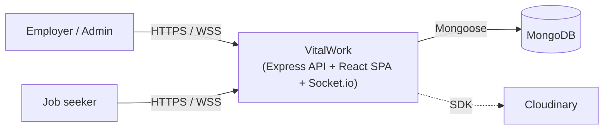
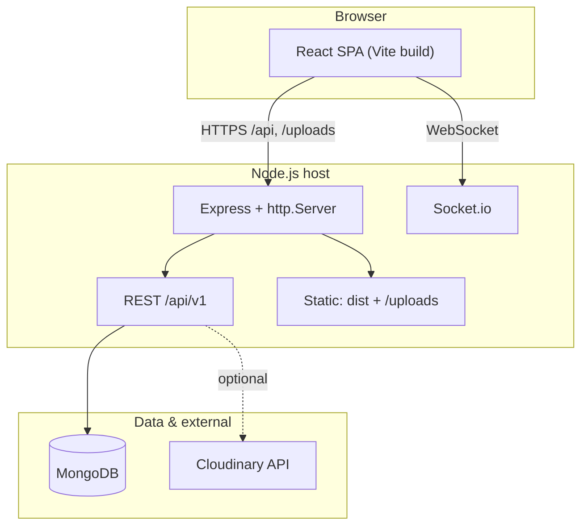
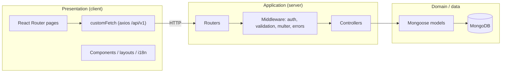
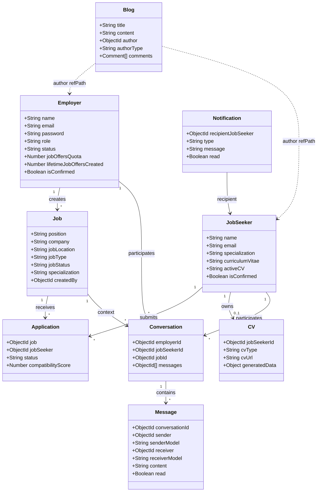
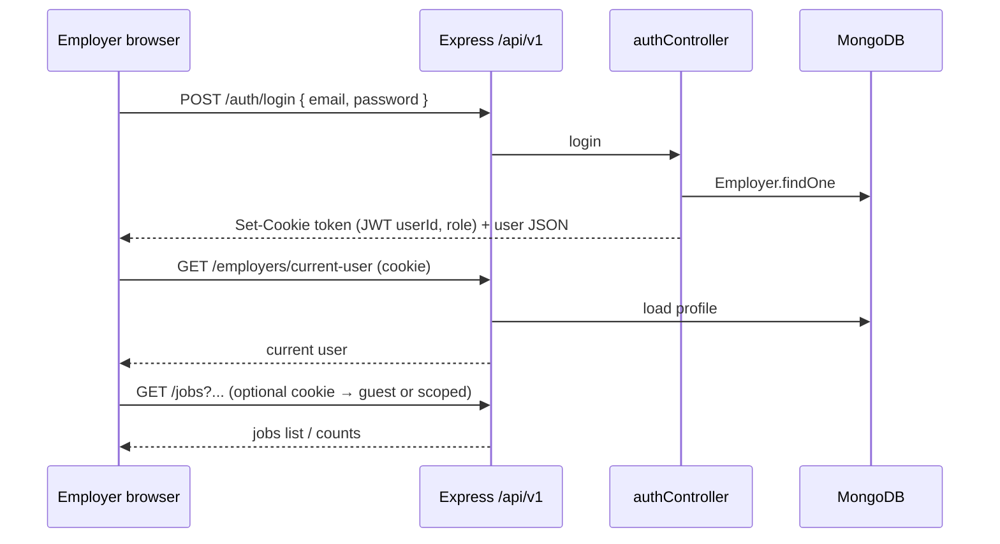
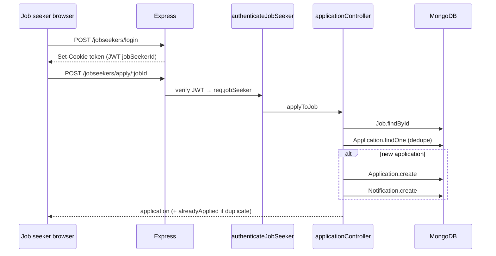
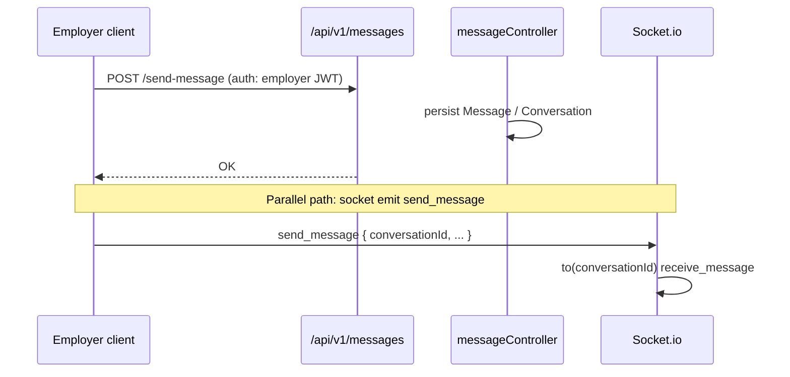
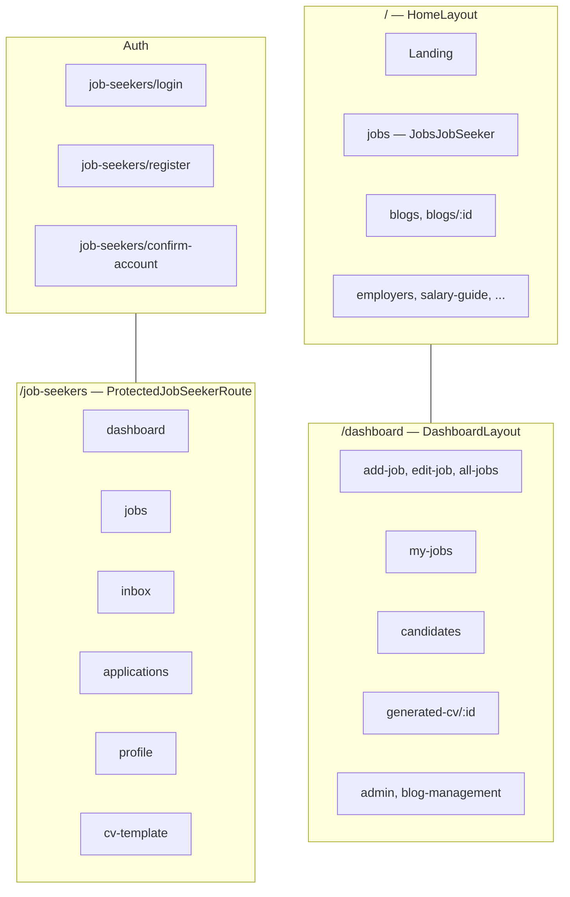

# VitalWork — System Design

 **VitalWork** stack (medical recruitment): actors, persistence model, HTTP API surface, real-time messaging, and the React client structure. Diagrams use [Mermaid](https://mermaid.js.org/) (flowcharts, class diagrams, and sequence diagrams compatible with common Markdown previews).

---

## 1. System context

VitalWork connects **employers** (hospitals, clinics, recruiters) and **job seekers** (medical professionals) around **job postings**, **applications**, optional **CV upload / generated CV**, **employer–seeker messaging**, and **blogs**. Persistence is **MongoDB** (Mongoose). The API is **Express**; the SPA is **React (Vite)** with `axios` calling `/api/v1/*` (dev proxy to the backend). **Socket.io** runs on the same HTTP server for chat fan-out. **Cloudinary** is configured for media; static uploads are served from `/uploads`.

---

## 2. Deployment view

Production-style layout: a single Node process serves the built SPA (`client/dist`), REST under `/api/v1`, static files under `/uploads`, and **Socket.io** on the same port.

**Local development:** Vite proxies `/api` → `http://localhost:5100/api` and `/uploads` to the backend (`client/vite.config.js`).

---

## 3. High-level layered architecture

---

## 4. Component diagram (backend)

```mermaid
flowchart TB
  subgraph Routers["Express routers (mount paths)"]
    JR["jobRouter /api/v1/jobs"]
    AR["authRouter /api/v1/auth"]
    ER["employerRouter /api/v1/employers"]
    JSR["jobSeekerRouter /api/v1/jobseekers"]
    BR["blogRouter /api/v1/blogs"]
    SR["statusRouter /api/v1/status"]
    MR["messageRouter /api/v1/messages"]
    CVR["cvRouter /api/v1/cv"]
  end

  subgraph MW["Cross-cutting"]
    AUTH["authenticateUser / authenticateJobSeeker"]
    GUEST["allowGuestForViewing"]
    PERM["authorizePermissions"]
  end

  subgraph CTR["Controllers"]
    JC["jobController"]
    AC["authController"]
    EC["employerController"]
    JSC["jobSeekerController"]
    APC["applicationController"]
    MSC["messageController"]
    BC["blogController"]
    CVC["cvController"]
  end

  JR --> JC
  AR --> AC
  ER --> EC
  JSR --> JSC
  JSR --> APC
  JSR --> MSC
  BR --> BC
  MR --> MSC
  CVR --> CVC

  ER --> AUTH
  MR --> AUTH
  JSR --> AUTH
  BR --> AUTH
  BR --> GUEST
  JR --> GUEST
```

**Notes from `server.js`:**

- `/api/v1/employers` is wrapped with `authenticateUser` at mount time.
- `/api/v1/messages` uses `authenticateUser` inside the router.
- Job seeker–specific routes use `authenticateJobSeeker` inside `jobSeekerRouter`.
- **Socket.io** rooms: clients `join_chat(conversationId)`; `send_message` broadcasts `receive_message` to others in the room.

---

## 5. Authentication model (dual JWT cookies)

Both personas store the JWT in an HTTP-only cookie named `token`, but **payload shape differs**:

| Persona          | JWT payload (relevant)                                                    | Middleware                                     |
| ---------------- | ------------------------------------------------------------------------- | ---------------------------------------------- |
| Employer / admin | `{ userId, role }`                                                      | `authenticateUser`, `authorizePermissions` |
| Job seeker       | `{ jobSeekerId }` (login); guest also `{ userId, jobSeekerId, role }` | `authenticateJobSeeker`                      |

Employer registration: first account becomes **admin**, others **employer**; OTP confirmation before login. Job seeker: register (optional CV file) → OTP confirm → login sets cookie.

---

## 6. Domain model (UML class diagram)

Relationships are inferred from Mongoose `ref` / `refPath` and indexes.

**Business rules (from controllers):**

- **Application**: unique pair `(job, jobSeeker)`; on create, a **Notification** may be created for the seeker.
- **Compatibility score**: deterministic hash placeholder from `jobId` + `jobSeekerId` (0–100).
- **Messaging**: REST controllers back conversations/messages; **Socket.io** provides live delivery when the UI uses it.

---

## 7. Employer: login and dashboard data (sequence)

---

## 8. Job seeker: apply to job (sequence)

**Guest job seeker:** `GET /jobseekers/guest` issues a JWT with non–ObjectId `jobSeekerId`; `applyToJob` rejects apply when `role === "jobseeker_guest"` or ID invalid (note: `authenticateJobSeeker` only attaches `jobSeekerId` from token, not `role`, so guest blocking relies on invalid ObjectId for `jobSeekerId` `"guest"`).

---

## 9. Messaging (employer path + real-time)

Job seeker mirror: `GET/POST` under `/api/v1/jobseekers/conversations` and `/messages/*` with `authenticateJobSeeker`.

---

## 10. Frontend route map (React Router)

High-level structure from `client/src/App.jsx`:

---

## 11. REST API summary (canonical prefixes)

Base: **`/api/v1`**.

| Area        | Methods / paths (representative)                                                                                                                                             | Auth                                                    |
| ----------- | ---------------------------------------------------------------------------------------------------------------------------------------------------------------------------- | ------------------------------------------------------- |
| Auth        | `POST /auth/register`, `login`, `confirm-email`, `resend-otp`; `GET /auth/guest`                                                                                   | Mixed                                                   |
| Jobs        | `GET /jobs`, `GET /jobs/:id`, `GET /jobs/all-jobs`; `POST                                                                                                              | PATCH                                                   |
| Employers   | `GET /current-user`, `PATCH /update-user`, `GET /my-jobs`, `GET /my-applications`, `PATCH /applications/:id/status`, admin subroutes                               | `authenticateUser` on router                          |
| Job seekers | `POST /jobseekers/register`, `login`, `confirm-email`; `GET /me`, `PATCH /me`; `POST /apply/:jobId`; applications, stats, notifications, conversations, messages | Cookie JWT; seeker routes use `authenticateJobSeeker` |
| CV          | `POST /cv/upload`                                                                                                                                                          | Job seeker + multipart                                  |
| Blogs       | `GET /blogs`, `GET /blogs/:id`; `POST /blogs/:id/like`, comments; `POST                                                                                                | PATCH                                                   |
| Messages    | `POST /messages/send-message`, `GET .../get-conversation/:jobId`, `get-messages/:conversationId`                                                                       | Employer JWT                                            |
| Status      | `GET /status/`                                                                                                                                                             | Public                                                  |

---

## 12. Cross-cutting concerns

- **Errors:** `express-async-errors` + `errorHandlerMiddleware` after routes.
- **Validation:** e.g. `validationMiddleware` on employer auth; job validation middleware for job payloads where wired.
- **Uploads:** `multer` for avatars (employer) and CV (registration / `/cv/upload`).
- **i18n:** Client-side `i18n` with locale JSON (`en`, `fr`, `ar`).

---

## 13. Technology inventory

| Layer     | Technology                                                |
| --------- | --------------------------------------------------------- |
| SPA       | React 18, React Router, axios, Vite                       |
| API       | Express (ESM), Mongoose, JWT cookie, cookie-parser        |
| Real-time | socket.io (server + client usage where implemented)       |
| Data      | MongoDB                                                   |
| Media     | Cloudinary config; local `/public/uploads` for CV files |

---

## 14. Document maintenance

Regenerate or extend this file when adding routes, models, or auth flows. Mermaid renders in GitHub, many IDEs, and static doc generators; for formal UML interchange, export diagrams to PlantUML or XMI using the same relationships described above.
