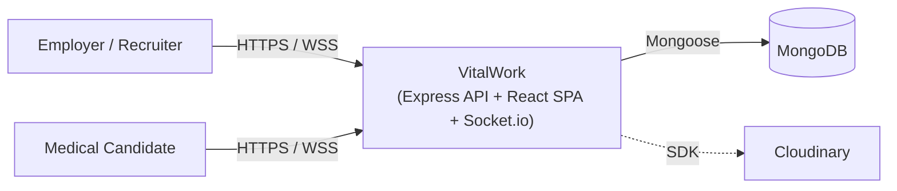
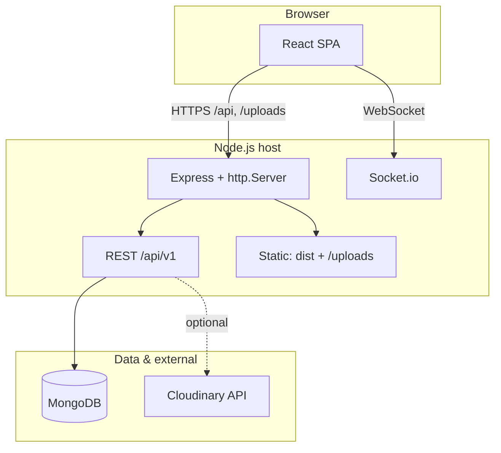
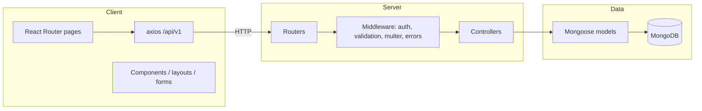
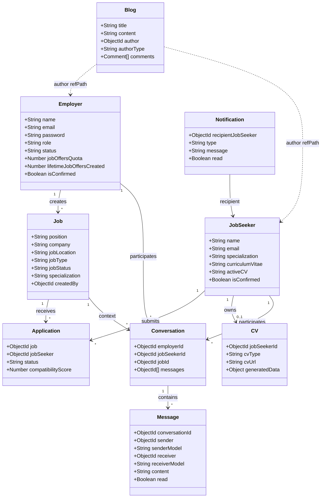

# VitalWork — System Design

**VitalWork** is a healthcare recruitment platform exclusively for medical professionals and healthcare employers. This document captures the platform architecture, API surface, authentication model, domain relationships, and key design improvements.

---

## 1. System context

VitalWork connects **healthcare employers and recruiters** with **medical professionals** through:

- **Job postings** for doctors, nurses, allied health, pharmacists, and clinical staff
- **Candidate profiles** with certifications, CV uploads, and availability
- **Application workflows** for review, shortlisting, and hiring
- **Employer–candidate messaging**
- Optional **blog content** for talent branding

The frontend is built with **React + Vite**. The backend is **Express + Node.js** with **MongoDB** via Mongoose. The application also supports live messaging through **Socket.io** and file/media handling through **Cloudinary**.

---

## 2. Deployment view

The current architecture runs a single Node.js process that serves:

- the built React application from `client/dist`
- REST endpoints under `/api/v1`
- static uploads under `/uploads`
- Socket.io on the same HTTP server

### Deployment note

This is acceptable for an MVP, but a production rollout should separate concerns:

- static content and uploads should be served through a CDN or dedicated storage layer
- API and WebSockets should be fronted by a reverse proxy/load balancer
- CORS and access policies should be tightened rather than allowing `*`

---

## 3. Layered architecture

The current implementation uses the standard Express middleware chain, with `authenticateUser`, `authenticateJobSeeker`, and `allowGuestForViewing` applied at route or router level.

---

## 4. Backend component view

```mermaid
flowchart TB
  subgraph Routers["Express routers"]
    JR["jobRouter /api/v1/jobs"]
    AR["authRouter /api/v1/auth"]
    ER["employerRouter /api/v1/employers"]
    JSR["jobSeekerRouter /api/v1/jobseekers"]
    BR["blogRouter /api/v1/blogs"]
    SR["statusRouter /api/v1/status"]
    MR["messageRouter /api/v1/messages"]
    CVR["cvRouter /api/v1/cv"]
  end

  subgraph MW["Middleware"]
    AUTH["authenticateUser / authenticateJobSeeker"]
    GUEST["allowGuestForViewing"]
    PERM["authorizePermissions"]
  end

  subgraph Controllers["Controller layer"]
    JC["jobController"]
    AC["authController"]
    EC["employerController"]
    JSC["jobSeekerController"]
    APC["applicationController"]
    MSC["messageController"]
    BC["blogController"]
    CVC["cvController"]
  end

  JR --> JC
  AR --> AC
  ER --> EC
  JSR --> JSC
  JSR --> APC
  JSR --> MSC
  BR --> BC
  MR --> MSC
  CVR --> CVC

  ER --> AUTH
  MR --> AUTH
  JSR --> AUTH
  BR --> GUEST
  JR --> GUEST
```

### Current route behavior

- `employerRouter` is secured by `authenticateUser` at mount time.
- `messageRouter` performs authentication inside route handlers.
- `jobSeekerRouter` contains both public and authenticated endpoints.
- There are loose public endpoints such as `/api/v1/all-jobs`, `/api/v1/all-employers`, and `/api/v1/all-seekers` that should be reviewed for intent and exposure.

---

## 5. Authentication model

JWT tokens are issued and stored in an HTTP-only cookie named `token`.

### Current payload mapping

- Employer / recruiter: `{ userId, role }`
- Job seeker: `{ jobSeekerId }`
- Guest fallback: `{ userId, role }` when no valid token exists

### Recommended improvement

Standardize the payload for both user types:

- `{ userId, role, jobSeekerId? }`

This avoids ambiguity and lets authorization middleware operate consistently across roles.

### Security considerations

- Use secure cookie settings: `HttpOnly`, `Secure`, `SameSite=Strict`/`Lax`
- Add token refresh or session expiration handling
- Add rate limiting to auth endpoints
- Prefer authorization errors over generic authentication failure messages where appropriate

---

## 6. Domain model

The main entities are:

- `Employer` — recruiters and employer accounts with roles, approval status, and posting quotas
- `JobSeeker` — candidates with specializations, credential data, CV references, and application history
- `Job` — healthcare job postings with specialization, location, contract type, and employer reference
- `Application` — candidate applications to jobs with status and compatibility score
- `CV` — uploaded candidate documents and generated resume metadata
- `Conversation` / `Message` — employer-candidate communication channels
- `Blog` — content marketing / employer branding posts
- `Notification` — user notifications for application events

### Business rules

- Applications are unique per `(job, jobSeeker)`.
- Compatibility score is currently a placeholder and should be replaced with a real matching algorithm over time.
- Messaging is backed by REST and optionally live-delivered with Socket.io.

---

## 7. Architect review and improvements

This design is a solid MVP for a recruitment platform, but it should tighten focus and improve security before production.

### Primary recommendations

- **Keep the scope healthcare recruitment only.** Remove any clinic operations language from requirements and system docs.
- **Standardize JWT payloads** so both employers and candidates use a consistent auth contract.
- **Validate WebSocket access.** Authenticate socket connections and verify room membership before joining or broadcasting.
- **Harden the public API surface.** Review public endpoints such as `/api/v1/all-employers`, `/api/v1/all-seekers`, and `/api/v1/all-jobs`.
- **Clean route fallback logic.** Use a single SPA fallback route and separate API 404 handling to avoid unreachable middleware.
- **Separate static assets for scale.** Move uploads/static files to Cloudinary/CDN and let API servers focus on data.

### Operational improvements

- Add **rate limiting** and **request validation** on critical endpoints.
- Use **secure cookies** and enable HTTPS in production.
- Add **monitoring / logging** around auth failures, DB connectivity, and socket events.
- Clarify which endpoints are guest-accessible and which require employer or candidate roles.

---

## 8. Recommended future iterations

1. **Mature matching**: replace the placeholder score with a real candidate-job matching algorithm.
2. **Employer dashboards**: add hiring funnel metrics, time-to-fill, and pipeline analytics.
3. **Notifications & workflow**: expand communication channels and track candidate stages.
4. **Scaling**: separate static/CDN, API, and WebSocket services when traffic grows.
